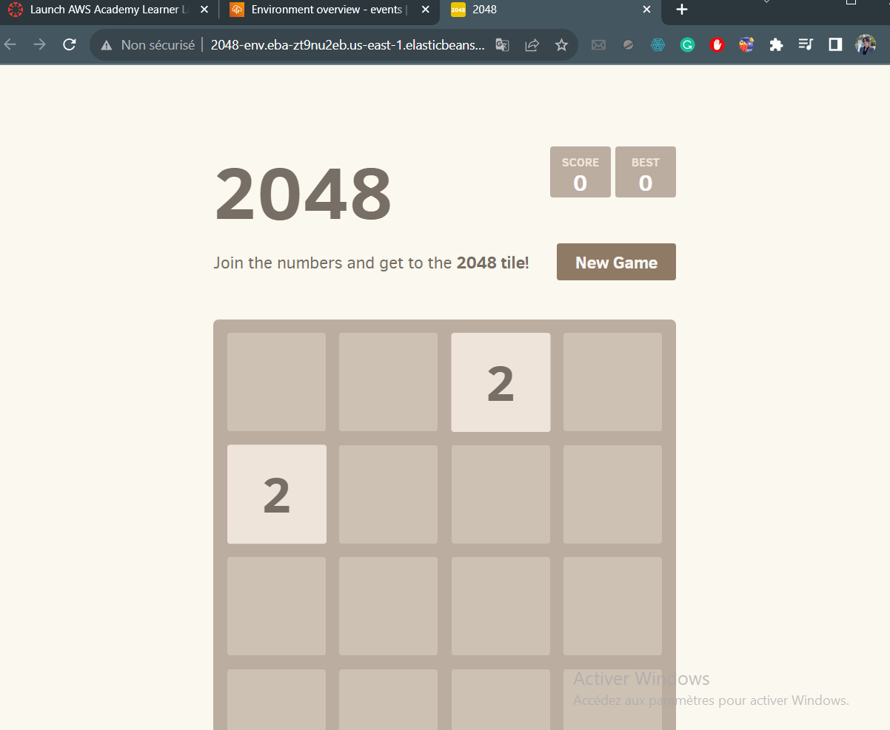

# Game-2048
Deployed a Dockerized version of the popular game "2048" on AWS Elastic Beanstalk.
# Dockerized 2048 Game on AWS Elastic Beanstalk

## Overview

This project demonstrates the deployment of a Dockerized version of the popular game "2048" on AWS Elastic Beanstalk. It leverages Docker for containerization and AWS Elastic Beanstalk for easy deployment and management.



## Project Structure

- **Dockerfile:** Specifies the configuration for the Docker image.
- **README.md:** Project documentation.

## Local Setup

To run the project locally, follow these steps:

1. Ensure you have Docker installed on your machine.
2. Clone this repository:

   ```bash
   git clone https://github.com/Meriem-611/dockerized-2048-game.git
3. Navigate to the project directory:

   ```bash
   cd dockerized-2048-game
5. Build the Docker image:

   ```bash
   docker build -t 2048-game .
7. Run the Docker Container:

   ```bash
   docker run -p 80:80 2048-game
9. Open your browser and visit http://localhost to play the 2048 game locally.

## Technologies Used
Docker
NGINX
AWS Elastic Beanstalk

## Deployment on AWS
To deploy the game on AWS Elastic Beanstalk:

1. Create an Elastic Beanstalk environment with Docker platform.
2. Upload the Docker image to AWS Elastic Beanstalk.
3. Configure environment settings and deploy the application.

## License
This project is licensed under the MIT License.

# Acknowledgments
Special thanks to Gabriele Cirulli for the original 2048 game.

Feel free to contribute, report issues, or provide feedback!
